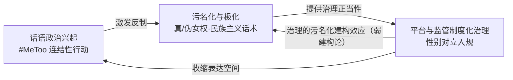
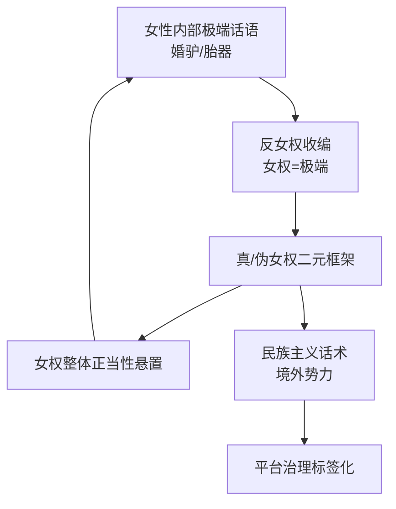
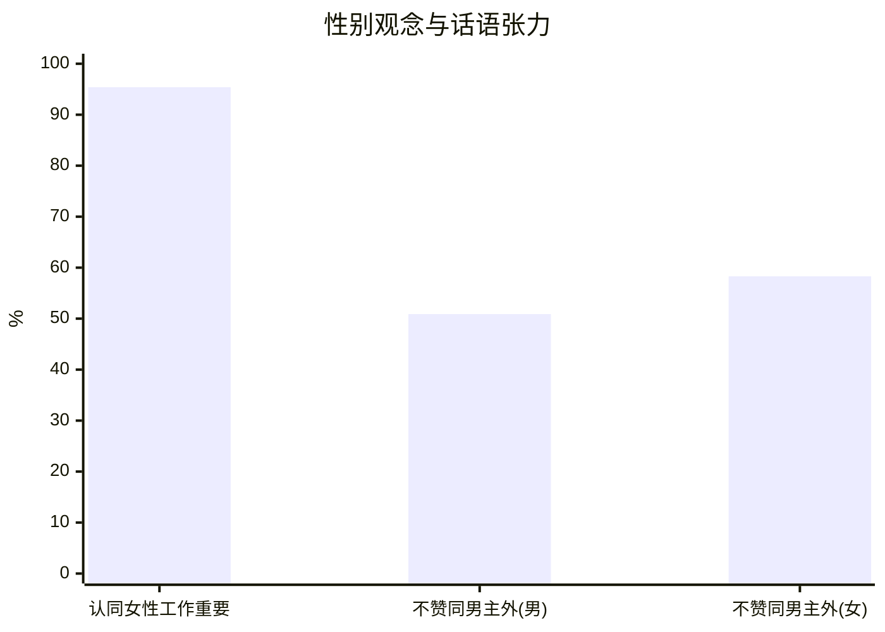
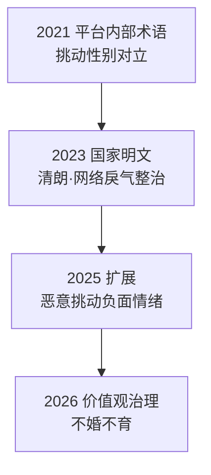
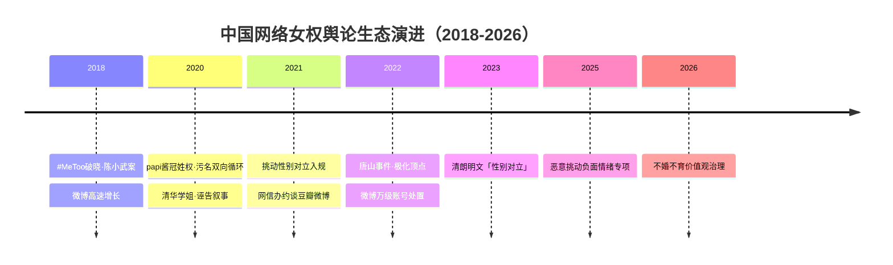

# 话语政治、污名化与治理收编：中国网络女权主义舆论生态的三方互构

**摘要**：中国网络女权主义的舆论生态，是「话语政治兴起—污名化极化—平台与监管制度化治理」三重机制持续互构的产物。本文以「制度—话语互动」框架，整合 2018 至 2026 年间微博、豆瓣、小红书等平台的性别议题演化，论证三者并非线性阶段，而是相互强化、相互构成的机制性循环（本文以机制共构而非因果推定呈现）。据此，本文以「生态互动」视角替代「压制—反抗」二元框架，边际贡献在系统互动建模与 2021 年后治理化转向的时段增量。

**关键词**：网络女权主义；舆论极化；污名化；平台治理；数字女权主义；民族主义；连结性行动

## 引言

中国网络空间已成为性别议题讨论的核心场域。截至 2024 年 12 月，中国网民规模达 11.08 亿，互联网普及率 78.6%，其中女性网民约占 48.9%[1]。庞大的参与基数使「女权」话语获得前所未有的可见度，也陷入持续的争议与治理之中。既有研究多沿三条线索展开：其一是对 2018 年中国 #MeToo 运动的动员机制研究[2-5]；其二是对「女拳」「田园女权」污名化标签的话语分析[6-8]；其三是对平台审查与治理的个案考察[9-11]。这三条线索各有所成，却多为单一平台、单一机制或单一时段的切片，尚未有人将污名化、极化、治理与民族主义话术作为互动的舆论生态系统整体建模。更关键的是，绝大多数研究止于 2021 年微博炸号、豆瓣解散小组，对 2021 年「挑动性别对立」入规之后的治理化转向，缺乏系统研究。本文尝试填补这两处空白，全文分析框架如图1所示。

**图1 三方互构生态概念图**



本文采用**机制化建模与过程追踪**的定性方法：以制度文本与话语语料为证据，按时间序列重构「兴起—污名化—极化—治理」的演进，不做强因果推定，将各方机制呈现为「互动/共构」关系；量化表述均转引自既有文献与官方通报。

## 第一节 兴起脉络：话语政治的正当化跃迁

中国网络女权主义的兴起并非无源之水：早在 2015 年「女权五姐妹」事件中，草根女权即已在审查博弈中艰难生长[12]，但将其推入主流视野的是 2018 年 1 月的北航陈小武案[13]。2018 年元旦，博士毕业生罗茜茜实名举报北航教授陈小武性骚扰，北航次日即暂停其工作，并于 1 月 11 日通报撤销其导师资格与教师资格，教育部随后撤销其「长江学者」称号。据当事人统计，至少有 7 名女学生受害[13]。这一事件首次在中国语境中实现了「网络实名举报—机构即时处置」的闭环，为此后一系列举报行动提供了可复制的路径与合法性叙事[13]。

从动员机制看，这一兴起并非组织化的街头运动，而是「连结性行动」的典型样本。曾敬涵指出，2018 年中国 #MeToo 在缺乏组织依托的条件下，借社交媒体实现了个性化、技术中介的扩散，参与者通过「#MeToo→#MiTu」等符号实践规避审查[3]。凌琦与廖飒飒则强调，2018 年刘瑜文章引发的知识分子大辩论，为 #MeToo 提供了正当化话语，挑战性别迷思并「回收」了女权主义[2]。黄月琴与黄瑶以「述行性连结」概括这一中文语境的传播机制，其经验分析基于 2018 年间 50 个引发舆论反响的反性骚扰举报案例样本[5]。全球范围内，#MeToo 话题首日被使用超 20 万次、次日超 50 万条，一个多月波及 85 个以上国家[14]，为中国的兴起提供了国际共振背景。

这一兴起的时代条件在于平台的快速扩张。2018 年底微博月活跃用户达 4.62 亿[15]（微博财报口径，仅作历史参照），#MeToo 中国恰爆发于微博用户高速增长期（如图2所示）。

**图2 微博月活跃用户趋势（2018—2024）**

```mermaid
xychart-beta
    title "微博 MAU（亿）"
    x-axis ["2018-12", "2024-12"]
    y-axis "月活跃用户" 0 --> 6
    line [4.62, 5.90]
```

同时，据第四期中国妇女社会地位调查（2020 年），女性以网络了解国内外重大事务的比例为 65.8%，18 至 24 岁女性更高达 91.2%[16]，说明年轻女性是数字空间的高参与群体。然而，这一兴起自始即以「低调话语政治」而非组织化运动展开[17]：举报者多为海外华人，以实名揭发与话题标签等权宜式言说进行，缺乏组织与制度通道；这一「海外华人实名举报」形态，虽获跨国舆论关注与背书，却也为其后的「境外势力」污名化叙事埋下伏笔[13]。弦子诉朱军案即为这一脆弱性的缩影——作为中国 #MeToo 中唯一走完完整诉讼程序的高关注案件，其「证据不足驳回」的一审、二审结局，与案件曝光前后部分声援账号遭平台处置的现象并行，共同构成此后性别议题讨论的制度性背景[18]。这一判断的局限在于，学界对当时女权表达的组织化程度缺乏系统量化数据，本文只能基于既有案例与文献作定性判断。

## 第二节 污名化话语生成：「真/伪女权」的二元建构

兴起并非中国网络女权的唯一面向，几乎同步的是「女权」标签的系统性污名化。大陆学界早在 2014 年即已讨论女权标签在媒介平台被污名化[6]，而这一过程在 2020 年代显著加剧。污名化的核心机制，是「真女权/伪女权」二元认知框架的建构。甘丽华对知乎 4440 条「田园女权」相关问答文本的话语分析[7]表明，讨论者通过这一二元对立，将不符合父权期待的女权表达归入「伪女权」而予以否定，污名化的功能并非精确指认某种行为，而是悬置女权主义的整体正当性；其中彩礼、生育、冠姓权是反复出现的高频议题[7]。污名化机制在知乎、微博等平台呈现跨平台同构性；不过该文语料取自知乎、年代较早，与微博个案存在平台与年代边界。

污名化并非单向的「男骂女」，而是双向循环（如图3所示）。papi 酱「冠姓权」风波即为一例：2020 年母亲节，部分自认「女权」的网民以「婚驴」「胎器」等词汇攻击已婚已育的 papi 酱，这些极端话语旋即被反女权阵营收编为「女权=极端」的证据，形成「内部攻击—外部收缴」的污名循环[19]。李银河评论指出，孩子随父姓或母姓与女性独立与否本无必然关联，推动男女平等才是关键[20]；而吊诡之处在于，这场争论最终演变为性别平等支持者之间的相互攻击，暴露出缺乏行动出口的无力感。

**图3 污名化双向循环机制**



谭舒月与王雅韻对微博「太空人雅集」超话的研究进一步揭示，中国网络厌女话语与女权话语「高度对应且同样流行」，构成「镜像对抗」，厌女话语持续压制数字女性主义的生长[8]。

这种话语层面的对立，与线下观念进步构成张力。据第四期中国妇女社会地位调查（2020 年），95.4% 的被访者认同「女性有收入工作很重要」，不赞同「男主外女主内」的男女比例分别为 50.9% 与 58.3%，较 2010 年分别上升 14.0 与 14.7 个百分点，35 岁以下女性约八成不赞同[16]。观念总体进步与话语高度对立的并存，正是污名化作为话语机制而非事实反映的佐证；不过，线下观念与线上言论不可互相推导，此处仅呈现两者的张力（如图4所示）。

**图4 观念进步与话语对立的张力**



**反方立场与回应**：一种强反方观点认为，「女拳」「田园女权」是对客观存在的极端女权现象的准确描述，而非污名化；papi 酱被「婚驴」辱骂、清华学姐「诬告」[21]都证明极端女权真实存在，标签只是话语市场的「自我净化」。本文接受「极端言论客观存在」的前提，但反驳「标签=客观分类」：其一，「真/伪女权」是被建构的认知框架而非客观分类，其功能在于悬置女权整体正当性[7]，这正是「污名」的定义性特征；其二，内部极端被系统性放大收编，个案极端性被放大为群体标签，构成「连带污名」而非「准确描述」[19]；其三，本文区分「批评极端行为」与「以标签否定女权整体正当性」，并如实呈现「诬告」叙事的真实性[21]。故「客观描述」说低估了标签从「个案指认」滑向「群体否定」的机制性力量。

## 第三节 舆论极化机制：民族主义话术与商业反噬

污名化话语的进一步升级，是舆论极化，其关键杠杆是民族主义话术的介入。Han 与 Liu 以「粉色女权」理论化数字女权与网络民族主义的合流与碰撞，揭示「境外势力」「不爱国」「西方思想渗透」等框定如何将女权表达政治化为不忠诚，反女权借此获得正当性[22]，这一话术可追溯至 2015 年「女权五姐妹」事件[23]。这一话术把性别议题从「社会问题」重构为「政治立场」问题，使女权表达天然处于防御位置；其「不可证伪」性放大了效力，任何性别讨论都可被指认为「受境外势力煽动」而难以自证，由此成为压制性别议题成本最低的修辞资源。这一机制获得单点截面佐证（佐证机制存在而非强度）：单蔓婷对共青团中央 2022 年 4 月发文后 24 小时微博语料的量化分析捕捉 23,507 则贴文、2,140 组对话，结论直接指明「以民族主义为特征的厌女话语将女权主义污名为『与西方势力同流合污的极端主义』」[24]；Bao 的语料库研究亦证实微博已将女权主义者系统贴上「极端」标签[25]。这一话术有清晰演进：自 2017 年《环球时报》指责「极端女权任由西方利用」，经 2019 年「真假女权」之辩，至 2022 年共青团中央直指「极端女权已成网络毒瘤」，官方与民间在「境外势力」框架上持续共振[26]。

唐山烧烤店打人事件（2022 年 6 月）是这一对撞的顶点。女性网民的集体恐惧叙事与反女权「境外势力」「西方思想渗透」叙事正面对撞[27]；官方话语内部亦呈现张力：办案机关以「黑恶势力个案」框架淡化性别维度，《中国妇女报》则连续评论主张对侵害妇女权益恶性案件「零容忍」[27]。这一事件还催化了平台端首次大规模处置：微博以「挑唆性别对立」为由分批次处置账号，至 6 月下旬累计禁言 12567 个、处置违规微博 50285 条[28]。

极化的放大机制有二。其一是「镜像对抗」：厌女话语与女权话语的对应与流行互为燃料，一方愈激进，另一方愈反弹[8]。其二是「商业反噬」：杨笠「普信男」言论引发的品牌抵制自 2021 至 2024 年反复出现，英特尔、梅赛德斯-奔驰、舍得酒业等品牌先后因发布其参与的广告或节目而卷入抵制风波[29]；其中京东事件最具样本意义：2024 年 10 月 14 日京东发布「跟着杨笠来京东买药」推广后，部分男性用户以退 PLUS 会员、赎回京东金融产品等方式抗议（「京东金融挤兑」说法已被京东官方辟谣），京东 4 天后（10 月 18 日）致歉并终止合作；据 QuestMobile 数据，京东男性用户占比近 60%[29]。这呈现「代言即抵制→下架/致歉」的可重复模式，性别对立话语已具备商业层面的可见反噬效应，舆论极化由此倒逼企业站队；但下架/致歉亦可能是公关避险而非认同抵制。清华学姐事件则生成「诬告」叙事：一次监控即证伪的误会，因当事女生先曝光后道歉的顺序瑕疵，被反女权话语系统收编为「女权=诬告」的证明，「小作文」「诬告」自此成为悬在女权运动头上的标签[21]。

本节量化证据的性质需要说明：民族主义话术的证据为起爆点后 24 小时的截面语料与标志性事件的时间线，属「机制存在且有截面佐证」层面，不作「长期频率」的强推断；商业反噬的证据为「案例数＋时间线」，缺乏统一的「抵制规模」口径，故本文不就商业损失金额作强论断。这些极化机制与平台治理存在内在关联：当性别对立被视为「戾气」时，平台与监管的介入便获得治理正当性，这正是下节制度化收缩的逻辑起点。

## 第四节 平台治理制度化：从矛盾性治理到治理收编

中国网络性别议题的平台治理，经历了从「矛盾性治理」到「制度化收缩」的演进。Gu 与 Heemsbergen 对弦子账号 89597 条评论的分析表明，平台化审查与女权表达并非简单压制，而是模糊博弈，表情包等实践成为规避审查的手段[9]。Chang 对小红书创作者的研究则揭示，自我审查已成为应对审查与厌女双重压力的常态策略，她们在「安全空间」营造与风险规避之间反复权衡[10]。这种「矛盾性」在 2021 年后逐步让位于制度化收缩。

制度化的轨迹清晰可辨（如图5所示）。2021 年 1 月起，「挑动性别对立」成为微博的独立违规类别[11]；同年 12 月，国家网信办先后约谈豆瓣与微博，分别罚款 150 万元与 300 万元，当年 1 至 11 月豆瓣被处置 20 次、累计罚款 900 万元，微博被处置 44 次、累计罚款 1430 万元[30][31]。2023 年 11 月，中央网信办「清朗·网络戾气整治」专项行动明文将「发布性别对立言论」列为治理对象[32]，「性别对立」由此从平台内部术语上升为国家明文。此后，治理范畴持续扩展：2025 年 9 月中央网信办部署开展「清朗·整治恶意挑动负面情绪问题」专项行动[33]，2026 年 2 月「清朗·2026 年春节网络环境」专项行动进一步将「不婚不育」纳入治理维度[34]。微博 2025 年 8 至 9 月持续处置「挑动性别对立」的高粉账号（8 月 19 日公告即处置 4 个）[35]，并响应清朗专项清理 1.6 万余条内容、处置 1200 余个账号[36]（后两者均属平台单方公告口径，且为多类型专项总量而非性别分项）。

**图5 治理制度化轨迹阶梯（2021—2026）**



豆瓣鹅组的命运是这一收缩在社区层面的缩影。这一约 60 万成员的女性主导社区，历经 2021 年 9 月「清朗」停用整改、2021 年 12 月约谈罚款、2022 年 4 月永久停用，直至 2025 年 7 月才以「豆瓣 π 组」之名半封闭复活[37]。对鹅组处置，境内媒体扬子晚报以「关得好」作正面评价，境外媒体端传媒则以「空间收缩」相框定，立场光谱并存。女性议题讨论空间从微博、豆瓣向小红书的迁移，正伴随治理强度的整体抬升。

治理的制度化同时伴随「治理即污名」的建构效应。Guan 与 Shang 基于 2021 至 2025 年微博大众评审 269 个案例指出，「性别对立」作为违规类别缺乏可操作定义，其判定高度依赖道德化判断而非清晰规则[11]。「治理即污名」这一命题源于吕频的观察[38]，本文将其降级为**弱建构论表述**：平台以公开公告将「女权表达」框定为违规范畴的行为本身，会向公众传递「女权=违规」的信号，构成一种制度性污名化机制；但本文不主张强因果，「治理的寒蝉效应」与「女权表达的事实违规」在时间上缠结，本文难以用现有素材做干净的因果归因。

**反方立场与回应**：治理正当论认为，中国网络性别议题的治理是正当的舆论秩序维护，针对的是「婚驴」「胎器」等辱骂词[19]、唐山事件后的万级账号乱象[28]等真实存在的极端行为，治理的正是「戾气」与「对立行为」本身，而非「女权表达」；「只打极端、保护真女权」恰是对真女权的保护。极端语言暴力与网络私刑确需规范，治理有其部分正当性；但本文聚焦三点反驳。其一，治理范畴的模糊性导致误伤：前述研究显示「挑动性别对立」作为违规类别缺乏可操作定义，合规的性别议题讨论与「对立言论」在实践中难以区分——弦子案中，当事人对「封闭空间性骚扰举证难」的公开质疑与案件「证据不足」的裁判结果并存，恰是这一模糊边界的体现[18]。其二，治理话语的去性别化遮蔽实质：2023 年「清朗·网络戾气整治」通知将「性别」与「地域、职业」并列，统一纳入「群体对立」式治理[32]，使性别议题的结构性内容被消解为「群体对立」表象。其三，「只打极端、保护真女权」的区分在实践中无法稳定成立，本文正是要揭示其不可操作性，而非为极端语言辩护。针对「境外媒体叙事操纵」指控，本文不采信「治理一律污名化」的境外单边叙事，仅析机制不作价值定性；针对「女拳洗白」指控，本文不将「极端女权」与「女权整体」混同，亦非为极端语言辩护。

## 第五节 理论框架适用性：西方概念的本土化修正

西方「数字女权主义」「连结性行动」「网络行动主义」框架在解释中国语境时需作本土化修正，本文的核心论点正是在这一修正中确立。

第一，连结性行动假设的个性化、低组织动员，在中国表现为「话语政治大于组织动员」。Bennett 与 Segerberg 的「连结性行动」框架[39]强调数字媒体中介下的个性化参与，中国 #MeToo 的扩散印证了这一点[3]，但其中国形态更以「权宜式言说、符号规避、自我审查」为特征[3,9,10]，组织化更低、制度化通道更缺。第二，「网络行动主义」的中国形态并非对抗式街头运动，而是「交易式行动主义」与「体制内协商」。Li 与 Li 提出「媒体作为核心政治资源」，威权体制下女权运动以去政治化策略展开[40]；Han 则概括为「低调 #MeToo 的话语赋权政治」[17]。「协商式女权主义」并无同名中文研究，本文以「交易式行动主义/体制内协商/话语政治」三个既有理论锚点承载其义。这一路径有可核验正面样本——「高铁卫生巾」议题（属低对抗度服务型诉求的特殊样本）：自 2022 年 9 月网友呼吁、12306 初以「私人物品」婉拒，经多轮呼吁，官方回应从「将记录向上反映」（2022）逐轮演进至「部分车次有此服务」（2024）、部分列车免费试点（2025），至 2026 年已有铁路部门通报在列车上线女性卫生用品销售[41]。这一「舆论呼吁→体制回应→公共服务供给」的链条印证，中国网络性别议题并非只能走向对抗或沉默，在话语、污名与治理的互动中存在协商增量的可能性（边界：可个体化满足的服务诉求可被吸收，政治化诉求仍走治理收缩）。第三，「数字女权主义」需纳入「民族主义话语的挤压」这一中国特有变量[22]。第四，交叉性视角在中国亦有不同展开：Yin 与 Sun 以「交叉性数字女权主义」指出性别议题与阶层、城乡、代际等多重不平等交织[4]，但西方交叉性强调的身份政治与跨议题联盟，在中国强治理语境下难以展开为组织化联合，更多以碎片化话语实践呈现。这四点修正共同指向一个判断：西方数字行动主义理论预设的「开放话语场—自主组织化—对抗性诉求」三角，在中国均被不同程度地改写。

上述修正的落点是「生态互动」视角：中国网络女权主义的形态必须置于话语、污名、治理三者相互构成的关系中才能理解，任何单一机制的解释都会因忽略另外两方的反作用而失真。

结构性背景为此提供了社会基础。据 UNDP 数据，中国性别不平等指数为 0.186、全球第 47 位[42]，性别平等观念总体增强而现实差距仍在。这种「观念进步与话语对立并存」的张力，正是「生态互动」框架的经验依据：女权议题在话语、污名与治理的三方互动中持续重构，而非单向的压制或反抗。从社区层面看，豆瓣鹅组停用后以「π 组」半封闭复活[37]，正是治理压力下公共讨论空间被不断重新界定边界的微观写照。

## 结论

本文重构了中国网络女权主义 2018 至 2026 年的舆论生态演化（图6），核心发现是：女权话语的兴起激发反女权污名化（「真/伪女权」二元框架），污名化升级为舆论极化并裹挟民族主义话术，极化又为平台与监管的治理化收编提供正当性，制度化治理进一步收缩女权表达空间；三者相互强化、相互构成（机制性互构，非因果推定），而非线性阶段。这一「生态互动」视角，替代了「压制—反抗」二元框架与碎片化解释。

**图6 舆论生态演进时间线（2018—2026）**



本文的贡献是机制性的整合，而非单点结论的首次提出。污名化机制[6-8]与治理现象[9,11]均已有先行研究，本文的增量在于：其一，将四者整合为跨平台、跨时段的互动生态模型；其二，补足 2021 年「性别对立」入规之后的治理化转向时段。本文的局限同样明确：其一，「治理即污名」的因果方向无法用现有素材作干净归因，仅作弱建构论表述；其二，民族主义话术与商业反噬的量化证据虽有 24 小时截面语料[24]与案例清单[29]佐证，但仍缺长期频率计量，「抵制规模」口径（人数/金额）不可得，部分媒体测算数据（如舍得事件市值影响）未经官方核验[29]；其三，案例与部分文献依赖境外媒体，虽已按来源分级与多方并列处理，仍需以更多境内一手材料补强。

未来研究可在三个方向推进：其一，对「境外势力」话术与女权话语共现的语料计量，以微博、知乎语料为目标，验证民族主义话术的机制强度；其二，对「性别对立」治理规则文本作历时比较，编码其范畴边界的变化，检验「制度化收缩」的轨迹；其三，对平台女权账号封禁作纵向追踪的事件史分析。若转定量，宜以不低于五千条的语料规模与中等效应量为目标，将机制性建模推进为可检验命题。

## 参考文献

[1] 中国互联网络信息中心. 第55次《中国互联网络发展状况统计报告》[R/OL]. (2025-01-17)[2026-09-09]. https://www.cnnic.net.cn/NMediaFile/2025/0220/MAIN1740036167004CKE0DITFO1.pdf.
[2] LING Q, LIAO S. Intellectuals debate #MeToo in China: legitimizing feminist activism, challenging gendered myths, and reclaiming feminism[J]. Journal of Communication, 2020, 70: 895-916.
[3] ZENG J. #MeToo as connective action: a study of the anti-sexual violence and anti-sexual harassment campaign on Chinese social media in 2018[J]. Journalism Practice, 2020, 14(2): 171-190.
[4] YIN S, SUN Y. Intersectional digital feminism: assessing the participation politics and impact of the MeToo movement in China[J]. Feminist Media Studies, 2021, 21(7): 1176-1192.
[5] 黄月琴, 黄瑶. 述行性连结与数字女性主义行动——基于中国MeToo运动的探讨[J]. 传播与社会学刊, 2021(57): 191-224.
[6] 杨雨柯. 激进的女权标签——女权主义如何在媒介平台被污名化[J]. 新闻与传播研究, 2014(S1): 94-109.
[7] 甘丽华. 父权制、网络厌女与女权主义的中国化诠释[J]. 传播与社会学刊, 2021(57): 159-190.
[8] 谭舒月, 王雅韵. 镜城中的中国网络厌女与数字女性主义发展困境——以微博「太空人雅集」超话群为个案[J]. 台湾传播学刊, 2023(44): 43-82.
[9] GU Y, HEEMSBERGEN L. The ambivalent governance of platformed Chinese feminism under censorship: Weibo, Xianzi, and her friends[J/OL]. International Journal of Communication, 2023, 17: 3824-3846. https://ijoc.org/index.php/ijoc/article/view/20453.
[10] CHANG A. Safe spaces for feminist activists online: Chinese networked feminists' self-censorship strategies in response to online misogyny and government censorship[J/OL]. Humanities and Social Sciences Communications, 2025, 12: 495. https://doi.org/10.1057/s41599-025-04802-2.
[11] GUAN Z, SHANG Z. Constructing gender antagonism: moralised platform governance in China[J/OL]. Media and Communication, 2026, 14. https://doi.org/10.17645/mac.12064.
[12] HONG FINCHER L. Betraying big brother: the feminist awakening in China[M]. London: Verso Books, 2018.
[13] BBC中文. 实名举报导师的北航女博士罗茜茜：我必须站出来[EB/OL]. [2026-09-09]. https://www.bbc.com/zhongwen/trad/chinese-news-42539003.
[14] BBC中文. #MeToo 五周年[EB/OL]. (2022-10-22)[2026-09-09]. https://www.bbc.com/zhongwen/trad/world-63256653.
[15] 新浪微博数据中心. 2018微博用户发展报告[R/OL]. (2019-03-15)[2026-09-09]. https://data.weibo.com/report/reportDetail?id=433.
[16] 全国妇联, 国家统计局. 第四期中国妇女社会地位调查主要数据情况[R/OL]. (2021-12-27)[2026-09-09]. http://paper.cnwomen.com.cn/zgfnb/html/2021-12/27/nw.D110000zgfnb_20211227_1-4.htm.
[17] HAN X. Uncovering the low-profile #MeToo movement: towards a discursive politics of empowerment on Chinese social media[J/OL]. Global Media and China, 2021, 6(3): 364-380. https://doi.org/10.1177/20594364211031443.
[18] 北京市第一中级人民法院. 二审依法公开宣判周某某诉朱某一般人格权纠纷案[EB/OL]. (2022-08-10)[2026-09-09]. https://bj1zy.bjcourt.gov.cn/article/detail/2022/08/id/6841486.shtml.
[19] 新京报. papi酱孩子随父姓，怎就踩了女权主义的「雷」[EB/OL]. (2020-05-11)[2026-09-09]. https://m.bjnews.com.cn/detail/158918773315432.html.
[20] 上观新闻. papi酱孩子随父姓遭攻击，李银河：要男女平等[EB/OL]. [2026-09-09]. https://www.shobserver.cn/wx/detail.do?id=247260.
[21] 每日经济新闻. 「清华学姐」称被学弟性骚扰，曝光个人信息让其「社会性死亡」？结果却是……[EB/OL]. (2020-11-21)[2026-09-09]. https://www.nbd.com.cn/articles/2020-11-21/1553491.html.
[22] HAN L, LIU Y. When digital feminisms collide with nationalism: theorizing "pink feminism" on Chinese social media[J]. Women's Studies International Forum, 2024: 102941.
[23] 王政. (自我)审查与全球视野下的中国女权网络[EB/OL]. (2020-07-10)[2026-09-09]. https://chinesefeminism.org/2020/07/10/(自我)审查与全球视野下的中国女权网络/.
[24] 单蔓婷. 极端女权的言说论战——新浪微博中「反女权」论述的分析[D/OL]. 台北: 政治大学, 2024[2026-09-09]. https://nccur.lib.nccu.edu.tw/handle/140.119/150193.
[25] BAO K. When feminists became 'extremists': a corpus-based study of representations of feminism on Weibo[J]. Discourse & Communication, 2023, 17(5): 590-612.
[26] Yaya. 中国网络女权二十年——从边缘到焦点[EB/OL]. (2023-07-19)[2026-09-09]. https://chinesefeminism.org/2023/07/19/yaya-online-feminism.
[27] BBC中文. 河北唐山暴力事件为何在中国网络延烧[EB/OL]. [2026-09-09]. https://www.bbc.com/zhongwen/trad/chinese-news-61784051.
[28] 中国新闻网. 唐山打人事件微博禁言上万违规账号[EB/OL]. (2022-06-22)[2026-09-09]. https://www.piyao.org.cn/2022-06/22/c_1211659544.htm.
[29] 德国之声中文网. 「普信男」抵制杨笠京东代言活动[EB/OL]. (2024-10-22)[2026-09-09]. https://www.dw.com/zh/普信男抵制杨笠京东代言活动/a-70568710.
[30] 国家互联网信息办公室. 国家网信办依法约谈处罚豆瓣网[EB/OL]. (2021-12-02)[2026-09-09]. http://www.cac.gov.cn/2021-12/02/c_1640043205326056.htm.
[31] 国家互联网信息办公室. 国家网信办依法约谈处罚新浪微博[EB/OL]. (2021-12-14)[2026-09-09]. https://www.cac.gov.cn/2021-12/14/c_1641080795548173.htm.
[32] 中央网信办秘书局. 关于开展「清朗·网络戾气整治」专项行动的通知[EB/OL]. (2023-11-17)[2026-09-09]. https://www.cac.gov.cn/2023-11/17/c_1701809613019558.htm.
[33] 中央网信办. 部署开展「清朗·整治恶意挑动负面情绪问题」专项行动[EB/OL]. (2025-09-22)[2026-09-09]. https://www.cac.gov.cn/2025-09/22/c_1760258688713582.htm.
[34] 新华网. 中央网信办启动「清朗·2026年营造喜庆祥和春节网络环境」专项行动[EB/OL]. (2026-02-12)[2026-09-09]. https://www.news.cn/legal/20260212/c7ad9636adb44ce7a89f41d6f4a15376/c.html.
[35] 光明网. 微博再处置一批挑动性别对立账号[EB/OL]. (2025-08-19)[2026-09-09]. https://m.gmw.cn/toutiao/2025-08/19/content_1304115625.htm.
[36] 微博管理员. 恶意挑动对立、宣扬暴力戾气！1200余个微博账号被处置[EB/OL]. (2025-09-30)[2026-09-09]. https://www.peopleapp.com/column/30050412454-500007120737.
[37] 扬子晚报. 因饭圈乱象封停三年，复活的豆瓣鹅组需要吸取教训再出发[EB/OL]. (2025-07-30)[2026-09-09]. https://www.yzwb.net/news/wy/202507/t20250730_243469.html.
[38] YANG W. 中国女权运动再遭打压 运动人士忧「政治污名化」[EB/OL]. (2021-04-15)[2026-09-09]. https://www.dw.com/zh/中国女权运动再遭打压-运动人士忧政治污名化/a-57208414.
[39] 班尼特, 塞格柏格. "连结性行动"的逻辑：数字媒体和个性化的抗争性政治[J]. 史安斌, 杨云康, 译. 传播与社会学刊, 2013(26): 211-245.
[40] LI J, LI X. Media as a core political resource: the young feminist movements in China[J]. Chinese Journal of Communication, 2017, 10(1): 54-71.
[41] 解放日报·上观新闻. 女子火车上突来月经弄脏床单被要求清洗或赔偿！好消息，部分列车已售卖卫生巾[EB/OL]. (2026-03-18)[2026-09-09]. https://www.jfdaily.com/wx/detail.do?id=1083513.
[42] UNDP. Human Development Report 2023/24: gender inequality index (GII)[EB/OL]. (2024-03-13)[2026-09-09]. https://hdr.undp.org/data-center/thematic-composite-indices/gender-inequality-index.

## 致谢

本文选题方向与核心洞察承蒙左运来的指导，特此致谢。

## AI 使用声明

本文在论衡（Lunheng）学术写作流水线辅助下完成：AI 承担了文献与数据检索、分析框架拟定、初稿撰写与图表绘制等辅助性工作，核心论点、研究问题界定与最终文责由作者承担。本文所有引用与数据均经来源核验与分级标注，未使用未经核验的生成性内容。

## 先行者说明

本文核心论点与若干既有研究存在交集，特此说明：就「女权/女拳」标签的生成与污名化机制而言，已有运动亲历者的编年综述、针对豆瓣女性社群的个案观察及多篇新闻报道先行触及；在同行评议文献中，杨雨柯（2014）、甘丽华（2021）、谭舒月与王雅韻（2023）等已分别就媒介平台中的女权标签污名化与「真/伪女权」话语建构作出研究（见参考文献[6-8]）。本文不宣称首次提出上述单点结论，其增量在于：以「话语政治—污名化极化—平台治理」三方互构的生态视角进行系统建模，并补足 2021 年「性别对立」入规之后的治理化转向时段与跨平台整合。
